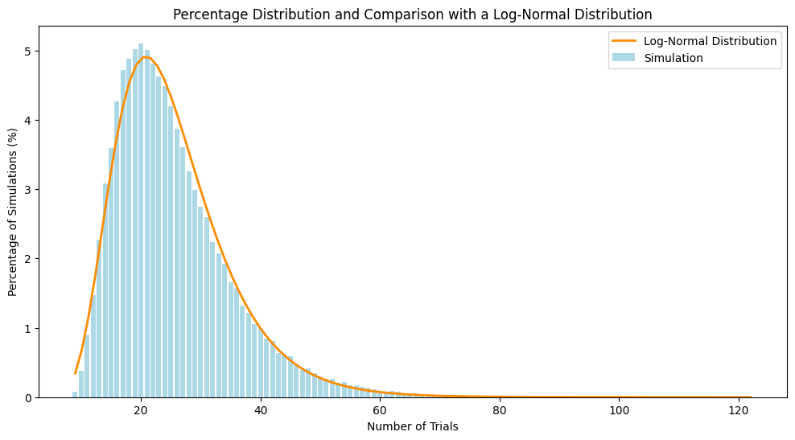

# Discord_april_fool_lootboxs_probabilities

Matthieu Hanania

For April Fool's Day 2024, Discord introduced a new lootbox system in its application. Each lootbox, when opened, yields one of nine possible different items. The objective is to collect all nine items to complete the game. This project aims to determine the average number of draws required to complete the game.

### Simulation

We've replicated this problem in Python and simulated 100,000 games, counting the number of draws for each game until completion.

### Results

The blue bars represent the percentage of simulations for each number of trials. The orange curve shows the expected log-normal distribution.
- We observe that the most common number of attempts is 20, with 5% of the simulations.
- 50% of the players completed the game in 24 attempts or fewer. 

### Related Work

A similar problem has been discussed in the following article: [Coupon Collector's Problem](https://en.wikipedia.org/wiki/Coupon_collector%27s_problem). It is expected that collecting all nine items could take about 26 tries under typical conditions.
